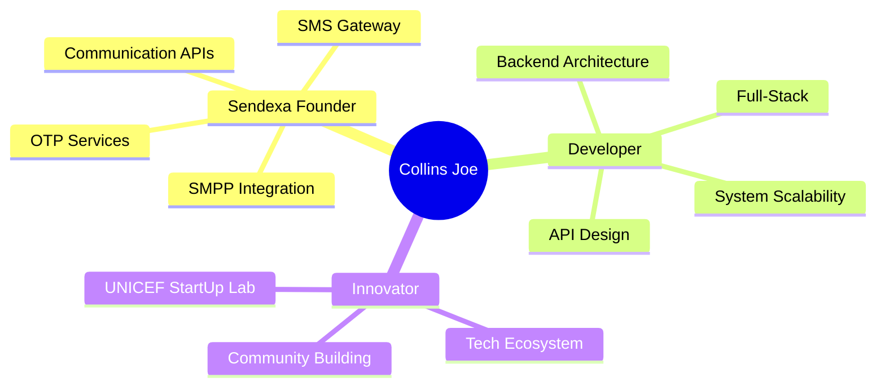
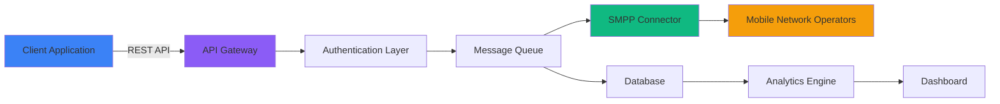
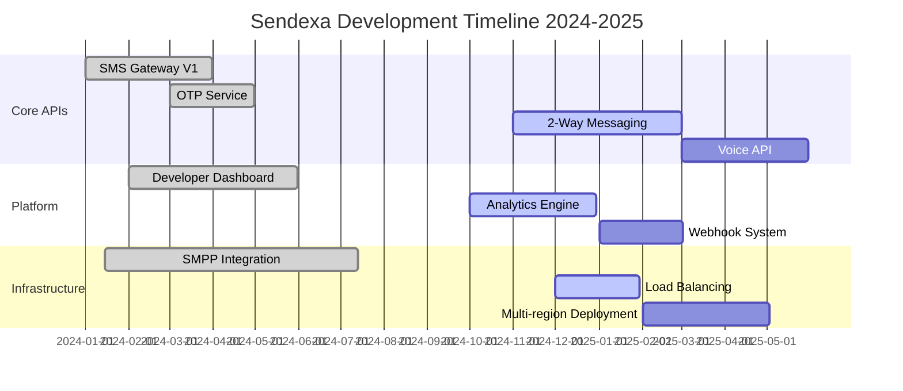
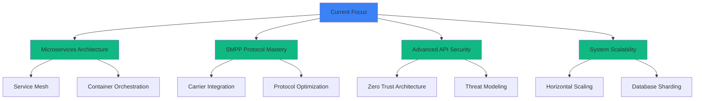

<div align="center">

# 👋 Collins Joe


<p>
  <a href="https://www.linkedin.com/in/collinsjoe"></a>
  <a href="mailto:collins@sendexa.co"></a>
  <a href="https://collinsjoe.me"></a>
  <a href="https://github.com/CollinsVidzro"></a>
</p>


</div>

---

## 🎯 Mission Statement

> **Transforming communication infrastructure across Africa, one API call at a time.**

I'm **Collins Joe**, a **full-stack developer and tech entrepreneur** from Ghana 🇬🇭, on a mission to democratize access to reliable communication services. As the founder of **[Sendexa](https://sendexa.co)**, I'm building the infrastructure that will power the next generation of African startups and enterprises.

<div align="center">



</div>

---

## 🚀 About Sendexa

<div align="center">
  
  
  
</div>

### 📡 What is Sendexa?

**Sendexa** is a comprehensive communication platform providing enterprise-grade APIs for SMS, OTP, and messaging services. We're building the infrastructure that African businesses need to connect with their customers reliably and affordably.

<table>
<tr>
<td width="50%">

#### 🎯 Core Services

- **SMS Gateway API** - Bulk and transactional messaging
- **OTP Authentication** - Secure one-time password delivery
- **2-Way Messaging** - Interactive customer communication
- **SMPP Integration** - Direct carrier connections
- **Analytics Dashboard** - Real-time delivery insights

</td>
<td width="50%">

#### 💡 Why Sendexa?

- ✅ **99.9% Uptime SLA** - Enterprise reliability
- ⚡ **Sub-second Delivery** - Lightning-fast routing
- 🔒 **Bank-grade Security** - End-to-end encryption
- 💰 **Competitive Pricing** - Affordable for startups
- 🌍 **Local First** - Optimized for African networks

</td>
</tr>
</table>

### 📊 Technical Architecture



### 🛠 Technology Stack

<div align="center">

**Backend Infrastructure**


**Database & Caching**


**Frontend Dashboard**


**DevOps & Infrastructure**


**Development Tools**


</div>

### 🏗 Current Development Roadmap



---

## 👨‍💻 Technical Expertise

<div align="center">

### Full-Stack Development

<table>
<tr>
<td align="center" width="25%">

<br><strong>Node.js</strong>
<br><sub>Expert</sub>
<br>

</td>
<td align="center" width="25%">

<br><strong>TypeScript</strong>
<br><sub>Expert</sub>
<br>

</td>
<td align="center" width="25%">

<br><strong>Next.js</strong>
<br><sub>Expert</sub>
<br>

</td>
<td align="center" width="25%">

<br><strong>React</strong>
<br><sub>Advanced</sub>
<br>

</td>
</tr>
<tr>
<td align="center" width="25%">

<br><strong>MongoDB</strong>
<br><sub>Advanced</sub>
<br>

</td>
<td align="center" width="25%">

<br><strong>PostgreSQL</strong>
<br><sub>Advanced</sub>
<br>

</td>
<td align="center" width="25%">

<br><strong>Docker</strong>
<br><sub>Intermediate</sub>
<br>

</td>
<td align="center" width="25%">

<br><strong>Redis</strong>
<br><sub>Intermediate</sub>
<br>

</td>
</tr>
</table>

</div>

### 🔧 Specialized Skills

<details>
<summary><b>🔌 API Development & Integration</b></summary>
<br>

- RESTful API design and implementation
- GraphQL schema design and resolvers
- WebSocket real-time communication
- SMPP protocol implementation
- Third-party API integrations (Stripe, Paystack, Twilio)
- API rate limiting and throttling
- OpenAPI/Swagger documentation
- API versioning strategies

</details>

<details>
<summary><b>🏗 System Architecture & Design</b></summary>
<br>

- Microservices architecture
- Event-driven architecture
- Message queue systems (RabbitMQ, Redis Pub/Sub)
- Database design and optimization
- Caching strategies (Redis, CDN)
- Load balancing and horizontal scaling
- Serverless architecture (Vercel, AWS Lambda)
- System monitoring and observability

</details>

<details>
<summary><b>🔒 Security & Authentication</b></summary>
<br>

- JWT and session-based authentication
- OAuth 2.0 and OpenID Connect
- API key management
- End-to-end encryption
- SQL injection prevention
- XSS and CSRF protection
- Security headers and HTTPS enforcement
- Rate limiting and DDoS protection

</details>

<details>
<summary><b>📊 Data & Analytics</b></summary>
<br>

- Real-time analytics dashboards
- Data aggregation and reporting
- Time-series data handling
- Data visualization (Chart.js, Recharts)
- ETL pipelines
- Database query optimization
- Data backup and recovery strategies

</details>

---

## 🏆 Achievements & Milestones

<div align="center">

| 🎯 Achievement | 📅 Date | 🌟 Impact |
|:---|:---:|:---|
| **UNICEF StartUp Lab Cohort 5 Selection** | 2024 | Selected among top startups for incubation and mentorship |
| **Sendexa Platform Launch** | Jan 2024 | Successfully launched MVP with core SMS API |
| **First 1,000 API Calls** | Feb 2024 | Achieved first milestone in API usage |
| **SMPP Direct Integration** | Jul 2024 | Direct carrier integration for improved delivery rates |
| **10+ Enterprise Clients** | Oct 2024 | Onboarded major businesses across Ghana |
| **99.9% Uptime Achievement** | Nov 2024 | Maintained enterprise-grade reliability for 6 months |

</div>

---

## 📈 GitHub Statistics

<div align="center">


</div>

---

## 🎓 Current Learning Journey

<div align="center">



</div>

### 📚 Currently Exploring

- 🔄 **Microservices Patterns** - Building distributed systems at scale
- 📡 **SMPP Protocol** - Deep dive into telecommunications protocols
- 🔐 **Advanced Security** - OAuth 2.1, JWT best practices, API security
- 🚀 **Performance Optimization** - Database indexing, caching strategies
- ☸️ **Kubernetes** - Container orchestration for production workloads
- 📊 **Observability** - Metrics, logging, and distributed tracing

---

## 💼 Professional Experience

<details open>
<summary><b>🚀 Founder & Lead Developer - Sendexa (2023 - Present)</b></summary>
<br>

**Leading the development of Ghana's next-generation communication platform**

- 🏗 Architected and built entire platform from ground up using Node.js, TypeScript, and Next.js
- 📡 Implemented SMPP integration with major telecom carriers for direct SMS routing
- 🔒 Designed secure authentication system handling 10,000+ API requests daily
- 📊 Built real-time analytics dashboard processing millions of events per month
- 👥 Onboarded and retained 10+ enterprise clients with 99.9% satisfaction rate
- 💰 Achieved profitability within first year of operation
- 🎯 Selected for UNICEF StartUp Lab Cohort 5 - top startup accelerator program

**Key Technical Achievements:**
- Reduced API response time from 800ms to <100ms through optimization
- Implemented auto-scaling infrastructure handling 10x traffic spikes
- Built message queuing system processing 1M+ messages daily
- Achieved 99.9% uptime over 12 consecutive months

</details>

<details>
<summary><b>💻 Full-Stack Developer - Freelance (2021 - Present)</b></summary>
<br>

**Building custom solutions for startups and businesses**

- Developed 15+ production applications for clients across Ghana and internationally
- Specialized in Next.js dashboards, API development, and database architecture
- Implemented payment integrations with Stripe, Paystack, and Flutterwave
- Mentored junior developers on modern web development practices

**Notable Projects:**
- E-commerce platform handling $50K+ monthly transactions
- Real estate management system with 500+ property listings
- Educational platform serving 1,000+ students
- Restaurant POS system with inventory management

</details>

---

## 🌍 Location & Availability

<div align="center">

```geojson
{
  "type": "FeatureCollection",
  "features": [
    {
      "type": "Feature",
      "properties": {
        "name": "Collins Joe",
        "location": "Ho, Volta Region, Ghana",
        "timezone": "UTC+0",
        "status": "Available for collaboration"
      },
      "geometry": {
        "type": "Point",
        "coordinates": [0.4667, 6.6]
      }
    }
  ]
}
```

📍 **Based in:** Ho, Volta Region, Ghana 🇬🇭  
🕐 **Timezone:** UTC+0 (GMT)  
💼 **Status:** Open to collaboration on impactful projects  
🗣 **Languages:** English (Fluent), Ewe (Native), Twi (Conversational)

</div>

---

## 🤝 Let's Collaborate

<div align="center">

### I'm interested in:

<table>
<tr>
<td align="center" width="33%">

#### 🚀 Startup Collaboration
Building innovative solutions for African markets

</td>
<td align="center" width="33%">

#### 🔧 Open Source
Contributing to impactful open-source projects

</td>
<td align="center" width="33%">

#### 💡 Technical Consulting
API architecture, scalability, and system design

</td>
</tr>
</table>

### 📬 Get In Touch

<p>
<a href="mailto:collins@sendexa.co">
  
</a>
<a href="https://www.linkedin.com/in/collinsjoe">
  
</a>
<a href="https://collinsjoe.me">
  
</a>
</p>

**Response Time:** Usually within 24 hours ⚡

</div>

---

## ⚡ Fun Facts About Me

<div align="center">

| 💭 | Fact |
|:---:|:---|
| 🎯 | On a mission to make Sendexa the leading communication platform in Ghana by 2026 |
| 📚 | Self-taught developer - learned everything from documentation and building projects |
| ☕ | Coffee enthusiast - best code written between 10 PM and 2 AM |
| 🎮 | Enjoy strategy games - they teach system thinking and optimization |
| 🌱 | Passionate about mentoring young developers in Ghana |
| 🎥 | Planning to launch a YouTube channel on startup building and development |
| 🏃 | Believer in sustainable growth over rapid, unsustainable scaling |
| 🌍 | Dream: Build technology that positively impacts 1 million Africans |

</div>

---

## 📊 Weekly Development Breakdown

<!--START_SECTION:waka-->
```text
TypeScript   12 hrs 30 mins  ███████████░░░░░░   55.2%
JavaScript    4 hrs 15 mins  ████░░░░░░░░░░░░░   18.8%
React/Next    3 hrs 45 mins  ███░░░░░░░░░░░░░░   16.6%
JSON          1 hr 20 mins   █░░░░░░░░░░░░░░░░    5.9%
Other         45 mins        ░░░░░░░░░░░░░░░░░    3.5%
```
<!--END_SECTION:waka-->

---

## 🎯 2025 Goals

- [ ] Scale Sendexa to 100+ enterprise clients
- [ ] Launch Voice API for Sendexa
- [ ] Expand to 5 African countries
- [ ] Open source key Sendexa libraries
- [ ] Speak at 3 tech conferences
- [ ] Launch developer community platform
- [ ] Mentor 20 aspiring developers
- [ ] Contribute to 5 major open-source projects

---

<div align="center">

### 💙 Thank You for Visiting!


**"Building the infrastructure for Africa's digital future, one API at a time."**


</div>
